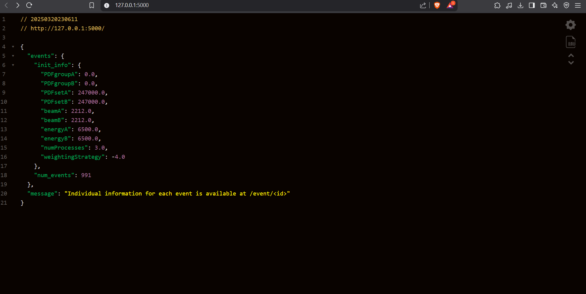
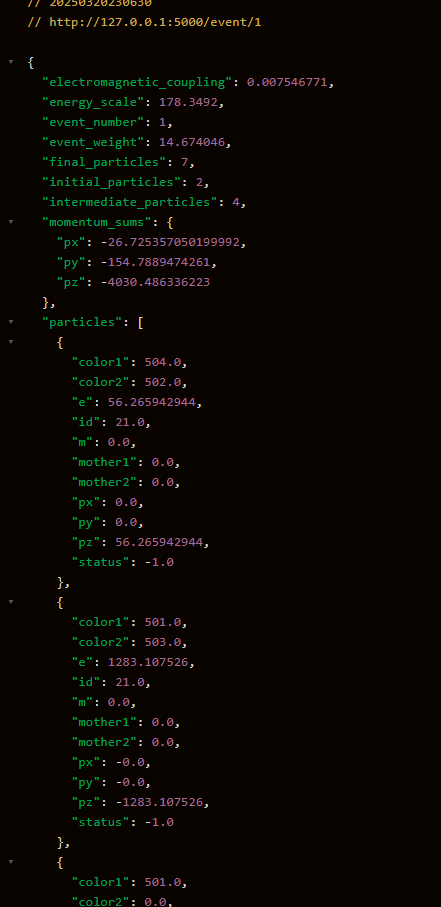
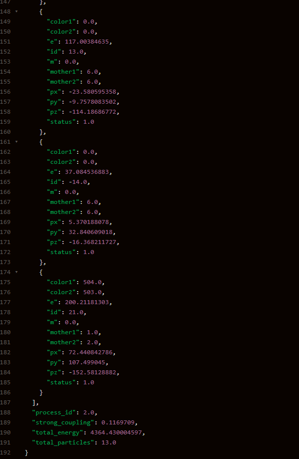

# Outputs and Design Process

## Output and Inferences

After running the command:
```bash
flask --app app run
```
and navigating to [http://127.0.0.1:5000/](http://127.0.0.1:5000/), you will see the following interface:



### Things to note
1. Events Object/JSON displays the initial conditions for the simulation and the number of events.
2. A message prompts you to go to the `/event/<id>` URL to get the required event info, tracked by its ID.

After navigating to the given endpoint, you will see the following JSON on the page:




> Note: These images show only part of the JSON; there are more particle objects.

### Evnet Details
The Event contains the following details:
- **Final Particles**
- **Initial Particles**
- **Intermediate Particles**
- **Momentum Sums**
- **Total Energy**
- **Total Particles**

These were calculated in part 2b of the problem. Also some specific information given by pylhe at the time of parsing is also added.

### Endpoints Served
So there are these 2 endpoints served by the app
1. `http://127.0.0.1:5000/`
2. `http://127.0.0.1:5000/event/<id>`


## Design Process and Inference

### Initial Steps
1. **Parsed LHE File**: After completing Task 2a, we have a parsed LHE file.
2. **JSON Structure**: The next step is to structure the data in JSON format.

### Categories of Information
- **Simulation-Specific Information**
- **Number of Events**
  - **Event-Specific Information**
  - **Number of Particles in Event**
    - **Particle-Specific Information**

### Structuring the JSON
- We included all the initial information required for the simulation in the `init_info` object (e.g., PDF group and set used, beams, and their energy).
- we stored each event's information in a list in the same order as they appear in the `.lhe` file. Each event can have a specific object with an ID (index + 1).
- For each event, we stored information about multiple particles in a list, with each particle having its own object.

## Why This Design?

### Scalability and Generalization
The main reason for this design is scalability and generalization. The modular design is easy to scale and apply to any `.lhe` file parsed by `pylhe`.

- For **user-given files**, pass the file to `pylhe` and create the desired JSON to serve the endpoints.
- If there are **multiple files**, create a list of JSON objects for each file and attach a simulation ID. This can serve the endpoint `simulation/id/event/id`(the structre is in task2.ipynb).

This structure makes our JSON scalable and makes sure that multiple files are handled smoothly.